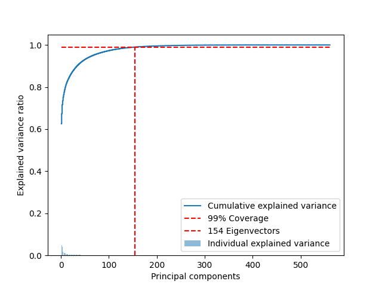

## Human Activity Recognition with Smartphones (HAR)

This project contains my solution of the HAR problem hosted on [Kaggle](https://www.kaggle.com/datasets/uciml/human-activity-recognition-with-smartphones). The accuracy of the model is around **0.95**.
```python
Accuracy: 0.953
```

#### Analysis
The dataset has a total of 561 features, and it is divided into two sets:
- Train: 7352 samples
- Test: 2947 samples

The dataset is well-formed, and the activities are distributed among the samples.
<p align="center">
    
</p>
The number of features is quite large, so an initial step is to try to reduce the number of features.

#### Dimensionality Reduction
In this case I've used the PCA algorithm to reduce the number of features. In the file `tools.py` there is the function `PCA` that performs the PCA's operation and  return the projection matrix that can be used to transform the data:
```python
pca_proj = tools.PCA(x_train, n_eigenvectors)
pca_data = np.matmul(x_train, pca_proj.T)
```
The variable `n_eigenvectory` is the number of eigenvectors to be used, looking at the plot the number of eigenvectors for a correct coverage of 99% of the variance is around **150**:
<p align="center">
    
</p>
After applying the PCA algorithm the data are transformed into the new space where the activities are visibly separated:
<p align="center">
    
</p>


After applying PCA to reduce even more the number of features, I've applied LDA, so now the number of features is `C-1` where `C` is the number of classes:
```python
lda_proj = tools.LDA(pca_data, y_train, n_classes=6)
lda_data = np.matmul(pca_data, lda_proj.T)
```

Now the data is transformed into the new space where now separability of the activities looks better:
<p align="center">
    
</p>

#### Classification
For this step I've used the `sklearn` library to perform the classification. I choose the `KNeighborsClassifier` algorithm because looking at the plot it is clear that there are some blobs where the classes are not well separated:
```python
knn = KNeighborsClassifier(n_neighbors=20)
knn.fit(lda_data, y_train)
```

#### Conclusion
The number of features has been reduced from **561** to only **5** and the accuracy of the model is **0.95**, looking at the confusion matrix it is clear that the model makes the wrong prediction with the classes `SITTING` and `STANDING`, as expected because in the plot the two classes are still not well separated.
<p align="center">
    
</p>
